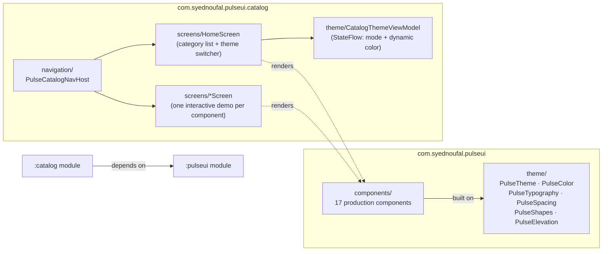

# Pulse UI

A production-grade Jetpack Compose design system — a themeable component library plus a live, navigable catalog app that demonstrates every component's states and variants interactively.

[](.github/workflows/build.yml)


---

## Why a design system

Every team that ships more than one or two Compose screens eventually reinvents the same problem: five slightly different buttons, three text field error-state patterns, and a color palette that only lives in one screen's file. A design system is the fix — a single, versioned source of truth for how the app looks and behaves, so that:

- **Consistency stops being a code review checklist item.** If every screen imports `PulseButton` instead of hand-rolling a `Button`, visual drift becomes structurally difficult rather than a discipline problem.
- **Design and engineering share one vocabulary.** `PulseSpacing.md`, `PulseButtonVariant.Destructive`, `PulseBadgeTone.Warning` — these are names a designer and an engineer can both say in a standup and mean the same thing.
- **Change is centralized.** Rebrand the primary color, retune the type ramp, or adjust the 8pt spacing scale once in `PulseTheme`, and every screen built on top of it updates automatically — no grep-and-replace across the codebase.
- **Accessibility and interaction polish are earned once.** Loading-state debouncing on `PulseButton`, semantic content descriptions on `PulseRatingBar`, tone-aware contrast on `PulseSnackbar` — these are solved in one place instead of re-solved (or missed) per screen.

Pulse UI is built the way a senior engineer would build this for their own team: state fully hoisted, APIs documented with KDoc, sensible defaults, and a catalog app that exists specifically to make every component's behavior verifiable at a glance.

## Module structure



```
pulse-compose-ui/
├── pulseui/     # :pulseui — the publishable Android library (com.android.library)
│   └── src/main/kotlin/com/syednoufal/pulseui/
│       ├── theme/          # PulseTheme, color/typography/spacing/shape/elevation tokens
│       └── components/     # one package per component (button, textfield, card, ...)
├── catalog/     # :catalog — the demo app (com.android.application), depends on :pulseui
│   └── src/main/kotlin/com/syednoufal/pulseui/catalog/
│       ├── navigation/      # CatalogDestination registry + NavHost
│       ├── theme/           # CatalogThemeViewModel (light/dark/system, dynamic color)
│       ├── components/      # shared catalog chrome (detail screen scaffold)
│       └── screens/         # HomeScreen + one interactive screen per component
├── gradle/libs.versions.toml
├── detekt.yml
├── .editorconfig            # ktlint rule configuration
└── .github/workflows/build.yml
```

## Component library

| Component | Description |
|---|---|
| `PulseTheme` | Root theming composable: Material 3 color scheme, dynamic color (Android 12+) with a hand-tuned fallback palette, typography, spacing, shapes, and elevation, all exposed via `CompositionLocal`. |
| `PulseButton` | Primary / secondary / tertiary / destructive variants with a built-in loading state that cross-fades a spinner in and disables the button. |
| `PulseTextField` | Error state with helper/error text, leading & trailing icon slots, password masking, and a live character counter. |
| `PulseCard` | Filled, outlined, and elevated content containers, optionally clickable. |
| `PulseChip` | Filter (togglable), assist (tap-to-act), and input (dismissible) chip variants. |
| `PulseAvatar` | Circular avatar with a deterministic initials-and-color fallback when no image is available. |
| `PulseBadge` | Status pills and a minimal dot indicator across five semantic tones (neutral/success/warning/info/error). |
| `PulseTopBar` | Screen header with optional back navigation, trailing actions, and a centered-title mode. |
| `PulseBottomBar` | Primary bottom navigation with hoisted selection state and per-item selected/unselected icons. |
| `PulseSnackbarHost` + `rememberPulseSnackbarState` | Tone-aware transient messages with an optional action button, built on a simple coroutine-friendly state holder. |
| `PulseDialog` | Confirmation/alert dialog with an optional destructive (error-colored) confirm action. |
| `PulseBottomSheet` | Modal bottom sheet with a consistent title/content layout. |
| `PulseSkeletonLoader` | Shimmer loading placeholders driven by a real `InfiniteTransition` + `Brush.linearGradient`, not a static stub. |
| `PulseEmptyState` | No-results / no-data / offline placeholders with an optional retry action. |
| `PulseSwitch` | Bare or labeled, row-clickable toggle. |
| `PulseSlider` | Continuous or stepped numeric input with a live formatted value readout. |
| `PulseRatingBar` | Tappable star input or read-only fractional (half-star) average display. |
| `PulseSegmentedControl` | Single-choice segmented button row for view switchers. |

Every component above ships with light and dark `@Preview` functions in the library module, and a dedicated, interactive demo screen in the catalog app.

## Catalog app

The `:catalog` module is a small, real app — not a screenshot gallery. From the home screen you can:

- Switch the whole app between **Light / Dark / System** and toggle **dynamic color** (Material You, Android 12+) live, via a `ViewModel` exposing a `StateFlow<CatalogThemeUiState>`.
- Browse every foundation and component grouped by category (Foundations, Actions, Inputs, Display, Navigation, Feedback).
- Open any component's detail screen and actually interact with it — toggle `PulseButton` between loading/disabled/enabled, drag `PulseSlider`, tap `PulseRatingBar`, trigger `PulseSnackbar` in each tone, open a `PulseDialog` and a `PulseBottomSheet`, and see live state changes reflected on screen.

## Tech stack

- **Kotlin** 2.0.21 with the Kotlin Compose compiler Gradle plugin (`org.jetbrains.kotlin.plugin.compose`) — no legacy `composeOptions` block.
- **Jetpack Compose** via the Compose BOM (2024.09.00), Material 3, `compose-animation`, `compose-foundation`.
- **Navigation-Compose** 2.8.x for the catalog app's in-app navigation graph.
- **Kotlin Coroutines** 1.9.0 for the snackbar state holder and ViewModel flows.
- **AGP** 8.6+, **compileSdk/targetSdk** 35, **minSdk** 24.
- **detekt** + **ktlint** (via `.editorconfig`) for static analysis, enforced in CI.

## Getting started

1. Open the project root in Android Studio (Ladybug or newer recommended).
2. Let Gradle sync — the version catalog at `gradle/libs.versions.toml` pins every dependency.
3. Select the `catalog` run configuration and run it on an emulator or device running API 24+ (API 31+ to see dynamic color in action).
4. To consume `PulseTheme`/components from another module, add `implementation(project(":pulseui"))` (or, once published, your Maven coordinates) and wrap your content in `PulseTheme { ... }`.

> **Note:** this repository intentionally omits the Gradle wrapper (`gradlew`, `gradlew.bat`, `gradle-wrapper.jar/.properties`) — Android Studio regenerates it on first sync, and it's excluded here since this project was authored in a network-isolated environment.

## License

MIT © 2026 Syed Noufal Gillani — see [LICENSE](LICENSE).
